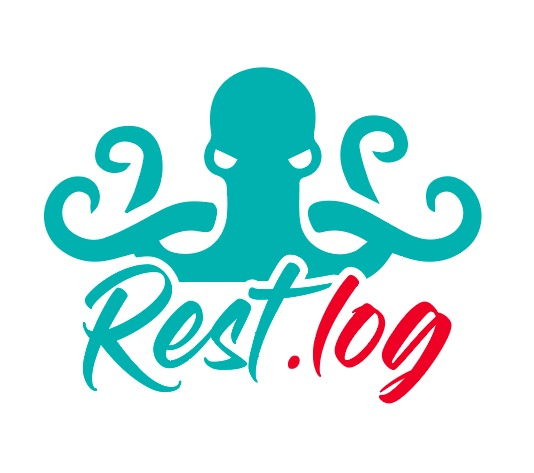
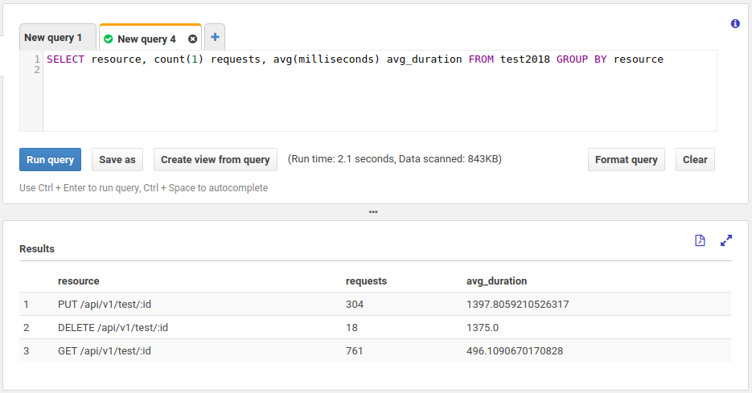

Designed to help log request-response pair integrate with express middleware
Example to Log with aws firehose


API Logger
===

## Table of Contents

* [Install and Prerequisites](##Install)
* [How use it](##How-use-it)
  - Init middleware
  - Event schema
* [Examples](##Examples)
  - Aws Athena
  - Events
* [Notes](##Notes)
* [Roadmap](##Roadmap)


## Install and Prerequisites

- node >= 6.x.x
- express >= 4

```shell
$ npm install restlog --save
```

## How use it

### Init Middleware
```javascript
const app = require("express")()
const restlog = require("restlog")

app.use(restlog({

  // Array of reject patterns in url
  rejectPatterns: [ /.ico/ ],

  // extracts from request or response and add to Event
  extracts: {
    isBot: (req, res) => isBot(req.headers['user-agent'])
  },
  // Array with each output of log desired
  logIn: [
    // log in stdOut
    event => console.log(event),
  ]
}))
```
### Event Schema
```json
{
  "path": String,
  "request": { 

  },
  "response": {

  }
}
```

* path
* request
  - headers
  - body

* response
  - headers
  - status
  - body

## Examples

### Save logs in Aws Athena

```javascript

const restlog = require("restlog")
const app = require("express")()
const isBot = require("isbot")
const flat = require("flat")

const AWS = require("aws-sdk")
const firehose = new AWS.Firehose({ apiVersion: "2015-08-04", region: "us-east-1" })

app.use(restlog({

  // Array of reject patterns in url
  rejectPatterns: [ /.ico/ ],

  // extracts from request or response and add To eventLog
  extracts: {
    isBot: (req, res) => isBot(req.headers['user-agent'])
  },
  // Array with each output of log desired
  logIn: [
    // put in firehose
    event => {

      firehose.putRecord({
        DeliveryStreamName: 'test',
        Record: {
          Data: [ JSON.stringify(flat(event)), "\n" ].join("")
        }
      }).promise()
      .then(res => console.log(res))
      .catch(console.error)
      
    },
    // log in stdOut
    event => console.log(event),
    event => /* ... saves on mongoDB etc*/
  ]
}))


app.get("/api/v1/test/:id", (req, res) => {
  setTimeout(() =>
    res.send({ msg: "ok" })
  , Math.random() * 1000)
})

app.put("/api/v1/test/:id", (req, res) => {
  setTimeout(() =>
    res.send({ msg: "ok" })
  , Math.random() * 3000)
})

app.delete("/api/v1/test/:id", (req, res) => {
  setTimeout(() =>
    res.send({ msg: "ok" })
  , Math.random() * 3000)
})


setInterval(() => 
  axios.get("http://localhost:3000/api/v1/test/234")
, 200)


setInterval(() => 
  axios.put("http://localhost:3000/api/v1/test/123")
, 500)


setInterval(() => 
  axios.delete("http://localhost:3000/api/v1/test/123")
, 8000)

app.listen(3000, "localhost", () => {
  console.log("start !in port 3000")
})
```

Afetr query in Aws Athena...



## Notes
* **Rest.log** was writen in 6.\x.\x node version and uses features available from this release.
* **Rest.log** was writen to work with expressjs.

## Roadmap
* Refac code in modules
* Test coverage in 70%

